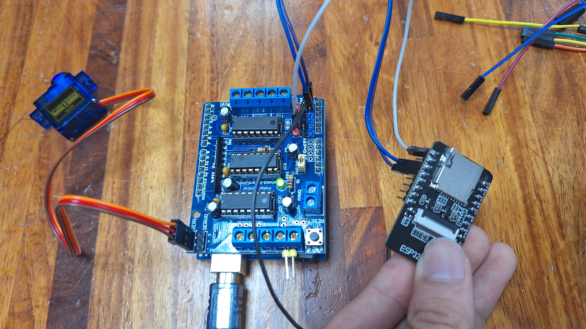
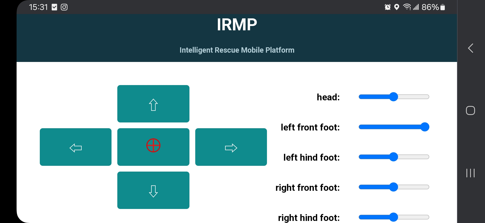

# ESP32-CAM & Arduino Car with L293D Project

**Last Updated**: May 18, 2024

## Project Description
### Objective
Set up an ESP32-CAM as an I2C master to communicate with an Arduino Uno slave at address 0x39. The communication involves the following steps:
1. ESP32-CAM sends "key value" to the Arduino at address 0x39.
2. Arduino Uno receives the command, prints each byte of data until it encounters a `\n`, and controls the movements of four DC motors and two servo motors based on the received data.

### Wiring
- **ESP32-CAM** → **Arduino**:
  - Pin 12 (SDA) → Pin A4 (SDA)
  - Pin 13 (SCL) → Pin A5 (SCL)
  - GND → GND
- Handle other connections as needed, ensuring the system operates at 5V.

### Notes
1. Upload this code to the Arduino, and the `esp32cam_arduinoCar_onArduino` file to the ESP32-CAM.
2. A common ground line is not mandatory but can enhance signal stability.
3. When uploading to the ESP32-CAM, avoid connecting other wires to prevent voltage division issues. It is recommended to upload in a no-load state and use the 5V pin and the diagonal GND pin for power supply.
4. This code is designed specifically for the ESP32-CAM and should not be used with other ESP32 series devices without consulting the ESP32 I2C documentation.
5. Based on tests, the ESP32-CAM is suitable only as a master, not as a slave.
6. When transmitting signals, note that bytes should be in hexadecimal ASCII code format, like 0xFF, and handle integer and character reception accordingly.
7. The slave device must have both `receiveEvent` and `requestEvent` functions to handle communication properly; otherwise, garbled output may occur.
8. WiFi Remote Controller ID: ESPcar, PASSWORD: 12345678. When connecting to WiFi, disable mobile data and open a browser to access 192.168.4.1 after connecting.
9. The directional buttons will only respond while being pressed; release to stop.
10. The sliders control servo motor angles. By default, the first two sliders control servo motors on pins 9 and 10, respectively. The servo motors will move to the specified angle when the sliders are released.
11. If the system does not operate after powering up, try disconnecting and reconnecting pins A4 (SDA) and A5 (SCL).
12. Ensure separate power supplies for the motors and the Arduino/ESP32-CAM to avoid damage.
13. After orienting your phone horizontally, remember to lock the orientation.

---

# ESP32-CAM & Arduino 小車項目

**更新時間**: 2024/05/18

## 功能簡介
### 目的
建立一個 ESP32-CAM 作為 I2C 主機，並傳訊息給地址 0x39 的 Arduino Uno 從機。傳輸訊息的步驟如下：
1. ESP32-CAM 傳輸 "key value" 給 0x39 位置的 Arduino Uno。
2. Arduino Uno 接收指令，逐個 byte 印製資料，直到 `\n` 字元，並判斷車子的四個直流馬達和兩個伺服馬達的動作。

### 接線
- **ESP32-CAM** → **Arduino**:
  - Pin 12 (SDA) → Pin A4 (SDA)
  - Pin 13 (SCL) → Pin A5 (SCL)
  - GND → GND
- 其餘接電自行處理，確保系統工作在 5V。

### 備註
1. 此程式碼需上傳至 Arduino，並搭配檔案 `esp32cam_arduinoCar_onArduino` 燒錄至 ESP32-CAM。
2. 共地線非必需，但能增強信號穩定性。
3. 燒錄 ESP32-CAM 時請避免插入其他線路，建議空載燒錄，並使用 5V pin 和對角線上的 GND pin 供電。
4. 此程式碼專為 ESP32-CAM 設計，不建議用於其他 ESP32 系列，請查閱 ESP32 I2C 說明。
5. 測試表明 ESP32-CAM 只適合作為主機，不適合作為從機。
6. 傳輸訊號時需注意 byte 的形式為 0xFF 等十六進位 ASCII code，需自行處理整數和字元的接收形式。
7. 從機端需同時具備 `receiveEvent` 和 `requestEvent` 來應對收發狀況，否則可能出現亂碼。
8. WiFi 遙控器 ID: ESPcar，密碼: 12345678。連接 WiFi 時請關閉行動數據，並在連接後開啟瀏覽器，訪問 192.168.4.1。
9. 前後左右鍵需持續按下才會有反應，放開即停止。
10. 滑桿控制伺服馬達角度，預設僅第一根和第二根控制 pin 9 和 pin 10 的伺服馬達，放開後伺服馬達會轉到指定角度。
11. 若接上電源後無法操作，請嘗試拔掉 pin A4 (SDA) 和 pin A5 (SCL) 再重新插入。
12. 確保電源供應系統分別供電給馬達和 Arduino、ESP32-CAM，以避免損壞。
13. 手機橫向擺放後記得鎖定方向。

